# Engineering Knowledge Base

This document serves as a living record of the engineering concepts, patterns, and technologies learned and applied in this repository. 

## 🗺️ Conceptual Knowledge Graph

```mermaid
graph TD
    %% Main Topics
    A[Browser Automation]
    B[Architecture & Persistence]
    C[Concurrency & Resiliency]
    D[Node.js Environment & Tooling]
    
    %% Subtopics
    A1["**Evasion (Stealth Plugin)**"]
    A2[Playwright Contexts]
    A3["**Headless vs Non-Headless Execution**"]
    B1["**Persistent Job Queues (SQLite)**"]
    B2["**API Design (Express)**"]
    C1["**Node.js Event Loop**"]
    C2["**Error Recovery & Retries**"]
    D1["**Package Scripts (npm start vs node)**"]
    D2["**Environment Variables (.env)**"]
    D3["**Reverse Proxy Tunneling (ngrok)**"]
    D4["**NAT Traversal & Firewalls**"]
    
    %% Relationships
    A --> A1
    A --> A2
    A --> A3
    B --> B1
    B --> B2
    C --> C1
    C --> C2
    D --> D1
    D --> D2
    D --> D3
    D3 --> D4
    
    %% Styling for actively used/implemented subtopics
    style A1 fill:#ffff00,stroke:#333,stroke-width:2px,color:#000;
    style A3 fill:#ffff00,stroke:#333,stroke-width:2px,color:#000;
    style B1 fill:#ffff00,stroke:#333,stroke-width:2px,color:#000;
    style B2 fill:#ffff00,stroke:#333,stroke-width:2px,color:#000;
    style C1 fill:#ffff00,stroke:#333,stroke-width:2px,color:#000;
    style C2 fill:#ffff00,stroke:#333,stroke-width:2px,color:#000;
    style D1 fill:#ffff00,stroke:#333,stroke-width:2px,color:#000;
    style D2 fill:#ffff00,stroke:#333,stroke-width:2px,color:#000;
    style D3 fill:#ffff00,stroke:#333,stroke-width:2px,color:#000;
    style D4 fill:#ffff00,stroke:#333,stroke-width:2px,color:#000;
```

## 🧠 Core Engineering Concepts Applied

### 1. Node.js Environment & Tooling
* **Concept**: Managing application startup, configuration, and networking.
* **Applied Through**: `npm start` aliases, `.env` files, and `ngrok`.
* **Reverse Proxy Tunneling (NAT Traversal)**: Because local laptops sit behind routers and firewalls (Network Address Translation - NAT) that block inbound traffic, we use tools like `ngrok`. Ngrok establishes an *outbound* connection from our machine to their cloud, and then forwards public traffic back through that established tunnel, bypassing firewall restrictions.
* **Learning Value**: 
    - **NPM Scripts**: Understanding that `npm start` is a wrapper script that delegates to `node src/index.js`.
    - **Configuration**: Using `.env` to securely manage `PORT` and `API_KEYS`.
    - **Networking**: Using `ngrok` as a reverse proxy to expose local ports to the public internet securely.

### 2. Browser Automation & Evasion
* **Concept**: Automating web interactions while avoiding bot detection.
* **Applied Through**: `puppeteer-extra-plugin-stealth` and Playwright contexts.
* **Headless Execution**: Understanding `headless: false` (visible GUI, good for debugging) vs `headless: true` (invisible background process, good for production to save RAM/CPU).
* **Learning Value**: Understanding how modern web applications detect automated traffic (e.g., navigator properties, WebGL fingerprinting, headless Chrome indicators) and how to mitigate them.

### 3. Persistent Job Queues
* **Concept**: Storing tasks reliably so they survive server restarts or crashes.
* **Applied Through**: SQLite (`better-sqlite3`) functioning as a local persistence layer for jobs.
* **Learning Value**: Trade-offs between memory queues (fast, volatile) vs. persistent database queues (slower, reliable).

### 4. Concurrency & Worker Architecture
* **Concept**: Managing multiple asynchronous tasks concurrently without blocking the main thread.
* **Applied Through**: Node.js event loop, asynchronous job runners.
* **Learning Value**: Handling race conditions, managing connection pools, and ensuring the application remains responsive under load.

### 5. Resilient Error Recovery
* **Concept**: Designing systems that expect failure and recover gracefully.
* **Applied Through**: Express error boundaries, retry logic for failed Playwright actions, and transaction rollbacks.
* **Learning Value**: Building robust scrapers that can handle unexpected DOM changes, network timeouts, or Claude UI rate limits.

---

## 🛠️ Technology & Tools Mastery

* **Node.js (Event-driven I/O, Package Scripts)**
* **Express.js (Middleware pipelines)**
* **Playwright & Puppeteer (Headless browsing)**
* **SQLite (File-based relational databases)**
* **ngrok (Reverse proxy/NAT Traversal)**
* **Jest (Unit/Integration testing)**

---

## 📚 Interview Topics Tracked

1. **"What is the difference between running `node index.js` and `npm start`?"**
2. **"Why do we store database passwords and API keys in a `.env` file instead of hardcoding them?"**
3. **"What is the difference between headless and non-headless browser automation?"**
4. **"How would you expose a local development server to an external webhook or plugin?"**
5. **"How does a tool like ngrok bypass local firewalls to expose your server?"** (Answer: NAT Traversal via outbound TCP connections).
6. **"How would you design a scalable web scraper that avoids bot detection?"**
7. **"Explain the difference between a persistent queue and an in-memory queue."**
8. **"How does the Node.js event loop handle long-running background tasks?"**
